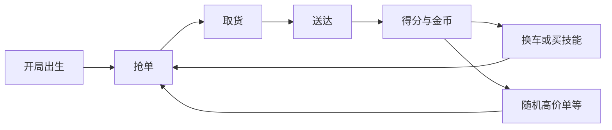

# 抖音小游戏《极速外卖》产品需求文档（PRD）

| 字段 | 内容 |
|------|------|
| 产品名 | 极速外卖 |
| 平台 | 抖音小游戏 |
| 文档版本 | v1.0 |
| 日期 | 2026-09-07 |
| 状态 | 已确认方向；MVP 范围已锁定 |

**关联文档：**

- [MVP 范围锁定](./MVP_SCOPE.md)  
- [内容设计总览（风格/道具/地图）](./design/README.md)  
- [美术风格规范](./design/ART_DIRECTION.md)  
- [道具与物品设计](./design/PROPS.md)  
- [地图与场景设计](./design/MAPS_AND_SCENES.md)  
- [用户故事与功能清单](./specs/USER_STORIES.md)  
- [界面信息架构与 HUD](./specs/UI_IA.md)  
- [数值初表](./specs/NUMBERS.md)  
- [灰盒验证方案](./graybox/GRAYBOX_PLAN.md)  

---

## 一、可行性结论（总评）

**总体判断：可行，且与抖音生态高度契合；但必须大幅收敛初始设想的复杂度。**

| 维度 | 评分 | 说明 |
|------|------|------|
| 题材契合度 | 高 | 外卖是全民共鸣场景，天然有「赶时间」压力，适配快节奏 |
| 传播潜力 | 高 | 载具反差、抢单互害、翻车名场面，易出短视频素材 |
| 核心玩法清晰度 | 中高 | 「接→送→赚」闭环直观，但「全流程作业」若照搬现实会过重 |
| 技术可行性 | 中 | 单机轻量可行；实时多人需自建房间服 + WebSocket，属中度工程 |
| 商业化适配 | 高 | 单局 2–4 分钟，适合激励视频（翻倍收益/试用载具） |

**关键风险（设计层消解）：**

1. **玩法过重** → 合并为「抢单→取货→送达」三步。  
2. **载具养成过重** → 局内短成长 + 外观收藏；超载具延后。  
3. **互害失控** → 前摇、冷却、保护态、干扰分上限。  
4. **性能与首包** → 小地图、同屏 ≤4 人、资源分包。  

**产品定位：**  
**「2–4 分钟一局的轻竞技派对外卖」** — 限时积分赛 + 轻度干扰对抗，不是经营模拟，不是开放世界。

**默认技术选型：** Cocos Creator 3.x + 抖音小游戏运行时 + WebSocket 房间服（或抖音云托管）；俯视角 2D/2.5D。

---

## 二、玩法合理性与可玩性评估

### 2.1 保留

- 限时送单压力  
- 抢单 / 争高价值单  
- 载具差异形成选择  
- 短促戏剧化的玩家互动  

### 2.2 砍改

| 原设想 | 问题 | 改法 |
|--------|------|------|
| 完整接单→等餐→配送→评价 | 操作链过长 | 「抢单→取货→送达」；等餐用倒计时表现即可 |
| 局外长期换车养成 | 与短局冲突 | 局内租车；局外只做皮肤 |
| 大型真实城市 | 迷路、加载重 | 固定小街区舞台 |
| 任意干扰 | 不公平 | 技能槽 + CD + 前摇 + 反制/保护 |
| 迈巴赫写实养成 | 违和 / P2W | 喜剧超载具，**非 MVP** |

### 2.3 三大目标落地

| 目标 | 落地 |
|------|------|
| 简便性 | 摇杆+一键；15s 三步引导；规则文案 ≤3 条 |
| 竞技性 | 争单、路线、技能、终局排名 |
| 可复玩性 | 随机订单池；后续天气/每日/段位（P1） |

---

## 三、产品概述

### 3.1 一句话介绍

在限时街区里当外卖员：抢单、换车、坑对手、准时送达，几分钟决出本局「速度之王」。

### 3.2 目标用户

- 抖音 16–35 岁碎片玩家  
- 喜欢「轻松理解 + 互坑名场面」的派对休闲用户  
- 可被搞笑配送短视频吸引的泛娱乐用户  

### 3.3 核心体验承诺

1. **10 秒内开跑**  
2. **每 30 秒一个小高潮**（抢大单 / 被减速 / 换上车 / 压线送达）  
3. **每局可分享瞬间**（名场面；完整投稿工具为 P2）  

### 3.4 时长与模式

| 模式 | MVP | 说明 |
|------|-----|------|
| 单机挑战 | 是 | 目标分 + NPC |
| 好友房 2–4 人 | 是 | 180s |
| 快速匹配 / 段位 | 否 | P1 |

标准局 **180 秒**；结算引导 ≤20 秒。

---

## 四、核心循环

**微观决策（每 10–20 秒）：**

- 近单稳分 vs 跨区抢高分？  
- 先换快车 vs 先送完？  
- 技能打断第一 vs 保自己送达？  

---

## 五、玩法需求详细设计

### 5.1 地图与空间

- 俯视角街区；电动车对角线约 **8–12 秒**。  
- 功能点：商家、顾客、换车站、道具箱（P1）、施工减速区。  
- 动线：主环路 + 2 条近路。  
- **MVP：1 张大学城**；首发完整版计划 3 张（大学城 / 写字楼商圈 / 夜市）。  

### 5.2 订单系统

**状态机：** 可抢 → 已接 → 取货中 → 配送中 → 完成 / 超时失败  

**属性：** 取送点、基础分、时限、重量标签、品质标签（热饮/易碎等，MVP 可仅表现）  

**刷单：** 场上 4–8 单；天价单稀有刷新 + 全图播报  

**持单：** MVP 最多 1 单  

**抢单：** 点气泡或订单栏；服务端裁定；失败 Toast「被 xxx 抢走」  

### 5.3 载具（局内短成长）

| 载具 | MVP | 定位 |
|------|-----|------|
| 共享单车 | 是 | 默认、窄路优势 |
| 电动车 | 是 | 均衡，完成 1 单后可租 |
| 摩托车 | 是 | 高速度、高租金 |
| 公路车 | 否 | P1 |
| 迈巴赫 | 否 | P2 喜剧超载具 |

换车仅在换车站；读条 **1.5s**；期间可被打断。  
数值见 [NUMBERS.md](./specs/NUMBERS.md)。

### 5.4 玩家互动

**MVP 技能：** 加速门、倒油、假单诱饵（详见数值表与用户故事）  

**公平硬规则：**

- 减益有前摇/预警  
- 主动 CD ≥12s  
- 送达前 2s 保护态  
- 禁止永久偷单；干扰分有上限  

**碰撞：** 对撞短硬直 ≤0.4s；防无限堵门  

### 5.5 单机

挑战关：固定图 + 目标分 + 1–2 NPC；用于教程、练习、匹配冷启动保底（匹配为 P1）。  

### 5.6 联机

- 好友房 2–4 人  
- 断线 15s 重连；超时 AI 托管  
- 服务器权威：位置低频同步 + 客户端预测；抢单/技能服务端裁定  

### 5.7 计分

`得分 = 基础分 × 时效加成 + streak + 干扰分(有上限)`  

终局排名 1–4。  

---

## 六、系统需求

### 6.1 新手与简便性

- 首局三步引导；可跳过  
- 摇杆 + 技能键  
- 失败轻惩罚，强调再来一局  

### 6.2 成长与可复玩性

- **MVP：** 随机订单 + 载具选择 + 好友再开  
- **P1：** 每日任务、段位、天气事件、周主题规则  
- **P2：** 超载具、投稿工具  

### 6.3 社交与传播

- MVP：房间号邀请  
- P1+：深链邀请、「来坑我」  
- P2：结算高光投稿  

### 6.4 商业化

- MVP：结算激励视频翻倍（不影响已定名次）  
- 对局中禁止插屏  
- 内购仅皮肤/表情/通行证（P1）；禁止永久属性碾压  

### 6.5 合规

- 虚构商家名，避免品牌侵权  
- 互害禁止长时间黑屏、强制人身攻击语音  
- 适龄与防沉迷按抖音要求接入  

---

## 七、技术与范围约束

### 7.1 性能预算

- 同屏玩家 ≤4；动态单位 ≤12  
- 中低端目标 30fps  
- 简单碰撞（圆/AABB），无重物理  
- 非首局资源分包加载  

### 7.2 MVP 范围（已锁定）

见 [MVP_SCOPE.md](./MVP_SCOPE.md)。摘要：

1. 1 图  
2. 3 载具（单车/电动/摩托）  
3. 订单三步 + 抢单  
4. 单机挑战 + 好友房  
5. 2 互害 + 1 加速  
6. 结算排名 + 激励视频翻倍  

**不做：** 迈巴赫、大世界、语音、观战、重养成、匹配段位。  

### 7.3 版本路线

| 版本 | 目标 |
|------|------|
| v0.1 灰盒 | 验证抢单+送达是否爽 |
| v0.2 | 验证换车决策 |
| v0.3 | 验证联机互害是否公平好玩 |
| v1.0 | 3 图、皮肤、广告、基础匹配 |
| v1.x | 超载具、赛季、事件卡池、投稿 |

---

## 八、验收指标

| 指标 | 目标 |
|------|------|
| 新手首次完成一单 | ≤40s |
| 平均单局时长 | 150–210s |
| 单局人均完成单数 | 4–8 |
| 教程跳过后仍理解玩法 | ≥80%（小样本） |
| 联机「觉得被恶心」 | ＜25% |
| 「再来一局」点击率 | ≥45% |
| 匹配等待（P1） | ≤15s（可 AI 填位） |

---

## 九、拍板清单

1. 做派对竞技，不做外卖模拟器。  
2. 载具是局内 build + 喜剧表达，不做重养成。  
3. 互动可读可反制，服务名场面而非纯破坏。  
4. 地图要小、规则要少、高潮要密。  
5. 先灰盒验证四段爽感，再扩迈巴赫与复杂事件。  

---

## 十、UI / 数值 / 用户故事索引

完整细则不在此重复，以免双源不一致：

| 文档 | 内容 |
|------|------|
| [specs/UI_IA.md](./specs/UI_IA.md) | 大厅 / 房间 / 局内 HUD / 换车 / 结算 / 引导 |
| [specs/NUMBERS.md](./specs/NUMBERS.md) | 载具、订单、技能、经济、NPC |
| [specs/USER_STORIES.md](./specs/USER_STORIES.md) | 用户故事、验收、功能清单 |
| [graybox/GRAYBOX_PLAN.md](./graybox/GRAYBOX_PLAN.md) | 灰盒任务拆分与验证清单 |
