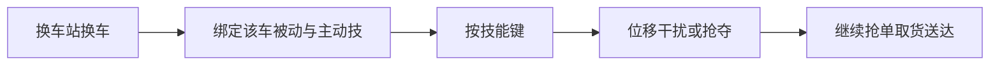

# 《极速外卖》载具专属技能规划

> 产品设计文档 · 版本 v1.2 · 2026-09-08  
> 状态：**已拍板并生效**（换车即换技；迈巴赫「拿来吧你」为 P2 招牌）

---

## 1. 结论

**有技能，但不是「攻击打人」；是「干扰 / 位移 / 资源博弈」类派对技。**  
**技能绑定载具：换车后主动技自动切换，每种车一眼可辨。**

| 不做 | 要做 |
|------|------|
| 血条、击杀、长时间硬控 | 短 CD、前摇/特效可读 |
| 无预警暗刀 | 送达前 2s **保护态**不可被抢/打断 |
| 单独花钱买互害技 | 干扰分有上限 |
| 「攻击/伤害/击杀」对外文案 | 对内称载具技 / 干扰技 |

操作保持：**摇杆 + 1 技能键 + 换车**。

---

## 2. 设计原则

1. 主循环仍是送单；技能服务抢路 / 抢单 / 保送达 / 名场面。  
2. 看到对方骑什么车，就知道大概会放什么招。  
3. 没有绝对最强车；强车必带「招恨」或操作代价。  
4. 减益/抢夺有前摇；保护态不可破；同类强控 CD 偏长。  
5. 每种车至少一个可截图/可投稿名场面。

---

## 3. MVP 三车（P0 · 必做）

| 载具 | 定位 | 被动 | 主动技 | 适合局势 |
|------|------|------|--------|----------|
| 共享单车 | 灵活钻营 | 窄路/近路移速 +15%；免费 | **铃铛惊吓** | 巷战、抢同点 |
| 电动车 | 均衡送单 | 取货读条 -0.2s | **外卖冲刺** | 常规刷分、新手 |
| 摩托车 | 高速压制 | 移速最高；转向略钝 | **甩尾倒油** | 追击、争天价单 |

### 3.1 主动技规格（MVP）

| 载具 | skill_id | CD | 前摇 | 效果 | 范围 |
|------|----------|----|------|------|------|
| 单车 | `SK_BELL` | 12s | 0.15s | 硬直 0.6s + 移速×0.85×1s | 半径 ~3.5m |
| 电动 | `SK_BOOST` | 12s | 0 | 自身移速×1.40×2s | 自己 |
| 摩托 | `SK_OIL` | 14s | 0.35s | 目标移速×0.50×2s | 最近敌人 ≤8m |

### 3.2 干扰分（MVP）

| 行为 | score |
|------|-------|
| 铃铛成功干扰 ≥1 人 | +10 |
| 倒油命中且目标 3s 内未送达 | +15 |

单局干扰分上限 **60**（含后期抢夺类得分时仍受此帽，防纯坑人流）。

---

## 4. 扩展载具技能池（发散 · 按版本解锁）

> 游戏内名称可用梗，系统 ID 用英文常量。获取方式均为**局内临时载具**（车站/事件/天价单奖励），禁止永久付费属性碾压。

### 4.1 公路车 `VEH_ROAD`（P1）

| 项 | 内容 |
|----|------|
| 定位 | 直线竞速、载重偏低 |
| 被动 | 直线移速 +18%；急弯时移速 -10% |
| 主动技 | **趴体冲刺** `SK_AERO` |
| 效果 | 朝面向方向瞬时位移 4m + 1.2s 加速；穿过对手不碰撞 |
| CD / 前摇 | 13s / 0 |
| 名场面 | 贴路牙子一骑绝尘抢单 |

### 4.2 外卖三轮 `VEH_TRIKE`（P1）

| 项 | 内容 |
|----|------|
| 定位 | 肉盾后勤、可持更多表现（叙事双箱） |
| 被动 | 被减速效果减弱 30%；移速略低于电动 |
| 主动技 | **保温箱盾** `SK_BOXSHIELD` |
| 效果 | 2.5s 内免疫 1 次减速/硬直；自身微减速 |
| CD / 前摇 | 16s / 0 |
| 名场面 | 硬吃倒油继续送 |

### 4.3 滑板 / 平衡车 `VEH_BOARD`（P1 活动）

| 项 | 内容 |
|----|------|
| 定位 | 极致灵活、脆皮 |
| 被动 | 转向极佳；撞人硬直惩罚 ×1.5 |
| 主动技 | **漂移甩尾** `SK_DRIFT` |
| 效果 | 短距离侧向闪避 + 身后留 1s「不稳区」使追击者减速 |
| CD / 前摇 | 11s / 0.1s |
| 名场面 | 楼道口鬼畜走位 |

### 4.4 出租车 / 网约车皮 `VEH_TAXI`（P1 喜剧）

| 项 | 内容 |
|----|------|
| 定位 | 中速、范围干扰 |
| 被动 | 鸣笛相关技能范围 +15% |
| 主动技 | **拼车号召** `SK_HAIL` |
| 效果 | 在身边生成 3s「假单诱饵」气泡（旧诱饵归来，绑在车上） |
| CD / 前摇 | 16s / 0.2s |
| 名场面 | 对手点假单骂街 |

### 4.5 迈巴赫（超载具）`VEH_MAYBACH`（P2）

| 项 | 内容 |
|----|------|
| 定位 | 喜剧核武器：极快、招恨、技能强但代价大 |
| 被动 | 移速极高；**热度**：开车期间被其他玩家技能命中时，自身受控时间 +20%；全图小地图高亮（众矢之的） |
| 主动技 | **拿来吧你** `SK_YOINK` |
| 效果 | 见下节详细规则 |
| 获取 | 天价单奖励 / 稀有事件空投；**仅本局临时** |
| 名场面 | 迈巴赫当面抢走奶茶 |

#### `SK_YOINK` 详细规则（公平硬约束）

| 规则 | 说明 |
|------|------|
| 目标 | 范围内持有「配送中」订单的对手（已取货） |
| 范围 | 半径约 4m；需面向大致朝向目标 |
| 前摇 | **0.45s** 全屏可见「土豪伸手」预警圈（可走位躲开） |
| 成功 | 对方订单转移到你（你变为配送中，目标点不变）；对方清空持单并短硬直 0.4s |
| 失败 | 目标进入保护态 / 出范围 / 前摇被自身硬直打断 → 技能进 CD 的 50% |
| 禁止 | 不可抢「取货前」订单；不可抢保护态；不可对同一目标 20s 内连抢两次 |
| CD | **22s**（显著长于普通技） |
| 持单冲突 | 若你已有单：成功抢夺后**掉落你原包裹在脚下**（需自己或他人捡起，3s 后可被任意人拾取送达）——制造混战名场面 |
| 得分 | 抢夺成功 +25（仍计入干扰分上限 60） |
| 反制 | 电动冲刺拉距；三轮盾可挡一次抢夺；保护态免疫 |

**文案：** 对外「拿来吧你」；禁止写成「偷打伤害」。

### 4.6 豪华喇叭（迈巴赫可选皮肤技 / 或独立超载具变体）（P2）

若同一超载具不想只做抢夺，可做皮肤切换技（仍一键）：

| 主动技 | **豪华喇叭** `SK_HORN` |
|--------|------------------------|
| 效果 | 大范围 0.7s 轻硬直（半径 6m） |
| CD | 18s；热度被动仍在 |
| 与 YOINK | **二选一**：事件拿到迈巴赫时随机或玩家选「抢夺型 / 震慑型」 |

默认主推：**拿来吧你**（更贴用户举例、传播更强）。喇叭作变体。

### 4.7 更多脑洞载具（P2+ 设定集 · 可选用）

| 载具梗 | skill_id | 主动技名 | 一句话效果 | 备注 |
|--------|----------|----------|------------|------|
| 共享单车「逃逸版」 | `SK_FENCEBREAK` | **拆了就跑** | 2s 无视减速带/施工区 | 单车皮肤技可选 |
| 电瓶「爆改」 | `SK_GHOSTMAP` | **虚空挂挡** | 小地图隐去标记 2s（模型仍可见） | 防纯隐身恶心 |
| 摩托「雨披」 | `SK_PONCHO` | **披风护体** | 雨天移速不减 + 轻推近身 | 绑天气事件 |
| 配送平板车 | `SK_CARGOWALL` | **货仓展开** | 窄路造墙 2s（可被冲刺穿？否，绕路） | 强控地形，CD 20s |
| 洒水车皮 | `SK_SPRINKLER` | **路面养护** | 前方留湿滑带 3s（敌减速、己略加速） | 喜剧公务风 |
| 巡逻车皮 | `SK_SIREN` | **临检一下** | 点名最近敌人强制停车 0.8s | 比铃铛强，CD 18s |
| 观光马车 | `SK_PHOTO` | **打卡耽误** | 范围内敌人打开「拍照 UI」1s（轻打断） | 夜市/景区图 |
| 直升机活动 | `SK_AIRDROP` | **空投单** | 给自己刷近距加急单（不抢人） | 活动限定 |
| 愚人节时光机 | `SK_REWIND` | **重来一单** | 当前单时限回到 50%（每局限 1） | 活动限定 |
| 赛博机车 | `SK_DASHLINE` | **导航锁路** | 自己导航线变成 2s「仅自己可走的加速带」 | P2 科幻皮 |
| 婴儿车梗 | `SK_STROLLER` | **母婴通道** | 2s 可穿建筑色块捷径（仅特定地图门） | 需关卡预埋门 |
| 冷链厢货 | `SK_COLDCHAIN` | **超时保鲜** | 本单失败倒计时冻结 3s | 保分向，非互害 |

以上备选**不进入 MVP 排期**；迈巴赫以 **拿来吧你** 为超载具默认招牌。

### 4.8 全载具技能速查（策划一览）

| 版本 | 载具 | 主动技 | 类型 |
|------|------|--------|------|
| P0 | 共享单车 | 铃铛惊吓 | 范围轻控 |
| P0 | 电动车 | 外卖冲刺 | 自增益 |
| P0 | 摩托车 | 甩尾倒油 | 单体减速 |
| P1 | 公路车 | 趴体冲刺 | 位移 |
| P1 | 外卖三轮 | 保温箱盾 | 免控 |
| P1 | 滑板 | 漂移甩尾 | 闪避+陷阱 |
| P1 | 出租车皮 | 拼车号召 | 诱饵 |
| P2 | **迈巴赫** | **拿来吧你** | **抢夺配送中订单** |
| P2 | 迈巴赫变体 | 豪华喇叭 | 大范围轻控 |

---

## 5. 换车与 UI

- 换车站每项：**速度星级 + 被动一句 + 主动技名**  
- Toast：`已换成迈巴赫 · 技能：拿来吧你`  
- 技能键文案随车切换  
- 超载具另有「热度」角标提示招恨  

### 经济（MVP）

- 单车免费；电动 80；摩托 150；开局金 50  
- P1/P2 载具租金或事件获取另表；**不卖永久强度**

---

## 6. 验收

- ≥70% 能说出三车技能差异（MVP）  
- 出现「为技能换车」行为  
- 迈巴赫试玩局：「被恶心」＜30%（超载具可略高于常规 25%，但须有反制体感）  
- 单局人均完成单数仍大致 4–8  

## 7. 关联文档

- [PROPS.md](./PROPS.md) · [NUMBERS.md](../specs/NUMBERS.md) · [PRD.md](../PRD.md) · [MVP_SCOPE.md](../MVP_SCOPE.md) · [USER_STORIES.md](../specs/USER_STORIES.md)
